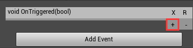

## 入门

插件用于在Detail中绑定DynamicMulticastDelegate(或EventDispatcher)，而无需编写新的蓝图或增加C++代码，在特定场景下能够方便解耦(类似Unity的EventSystem)，使用本插件，只要将本插件复制到Plugin目录下即可，由于本插件对Detail进行了注入，在任何Actor身上都能使用。

- 增加绑定事件: 单击AddEvent按钮，选择Actor包含的MulticastDeleget 

- 增加绑定项: 点击加号按钮，新增一个绑定条目 

- 选择绑定对象: 单击绑定项第二行选择绑定对象，吸管用于选择场景内摆放的对象，放大镜将视口对齐至对象 

- 选择绑定函数: 单击绑项第一行选择绑定的函数，当前只能选择与事件签名一致的非静态函数 

- 移除绑定项: 单击空白处选中绑定项，然后点击 **-** 删除绑定项 

- 移除整个事件: 单击右上角的 **X** 即可移除绑定项 

- 修复事件: 当事件改名或修改参数的时，事件会被无效化，但是其所属的绑定信息并不会被清除，点击右上角的 **R** 选择一个与原事件签名相同的事件来修复该事件 

- 无效的函数: 当函数改名或修改参数时，函数会被无效化，重选函数即可修复 

## 事件绑定的时机

事件将会在World初始化的时候绑定，对于跨Level的绑定，事件将会在该Level被加载时绑定

## 跨Level绑定

本插件支持Actor的跨越Level绑定，仅在绑定双方Actor同时存在时生效，Level可以多次装卸

## 性能

在Level被载入或World初始化时，EventBinder会遍历一次绑定数据并实施绑定，这是唯一的性能开销
